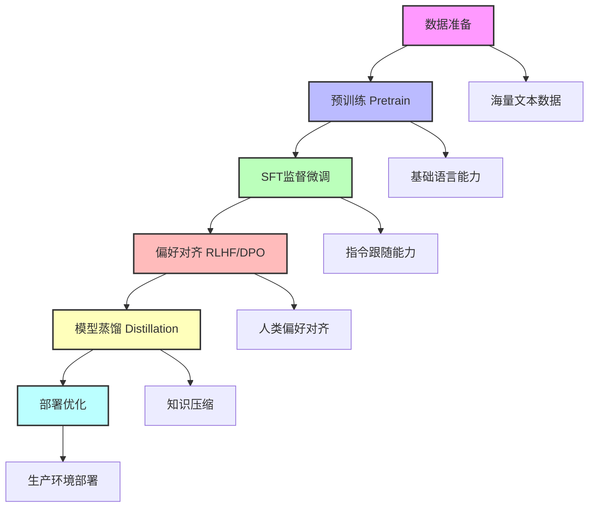
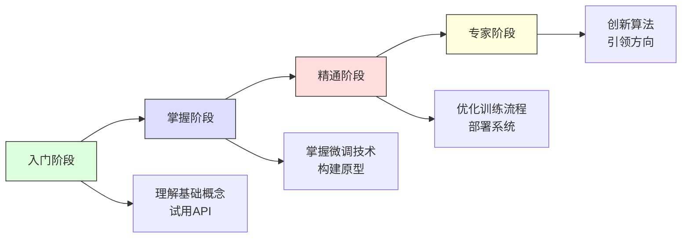

在人工智能快速发展的今天，大语言模型（Large Language Models, LLMs）已经成为技术创新的核心驱动力。从GPT系列到Llama，从ChatGLM到Qwen，这些强大的模型背后都遵循着一套精心设计的训练流程。本文将深入解析从零开始构建一个现代化大语言模型的完整流程，揭示每个阶段的技术原理和实践价值。

## 一、基础构建：Pretrain（预训练）

### 技术原理深度解析
预训练是大语言模型的**奠基阶段**，模型通过在TB级别的无标注文本上进行自监督学习，掌握语言的统计规律和世界知识。这一过程可以看作是在海量数据中挖掘语言的**潜在结构**。

#### 核心训练任务
1. **自回归语言建模（Autoregressive LM）**：
   - **数学形式**：$P(x_1, x_2, ..., x_n) = \prod_{i=1}^n P(x_i | x_{<i})$
   - **代表模型**：GPT系列、Llama、Qwen
   - **优势**：自然适合文本生成，因果注意力机制

2. **掩码语言建模（Masked LM）**：
   - **数学形式**：$P(x_{masked} | x_{observed})$
   - **代表模型**：BERT、RoBERTa
   - **优势**：双向上下文理解，适合分类和表征任务

3. **混合训练策略**：
   - **T5框架**：将所有NLP任务统一为文本到文本转换
   - **UL2**：统一多种去噪目标
   - **GLM**：结合自回归和自编码优势

#### 关键技术参数
- **数据规模**：现代大模型通常训练在1-10万亿token的数据集上
- **模型参数**：从70亿到7000亿参数不等
- **训练时长**：数千到数万GPU天（A100/H100级别）
- **优化器**：AdamW、Adafactor等自适应优化算法

### 实际应用与挑战
#### 数据工程实践
```python
# 现代预训练数据处理流程示例
def preprocess_pretraining_data(texts):
    # 1. 质量过滤（去除低质量内容）
    texts = filter_by_quality(texts)

    # 2. 去重（避免记忆偏差）
    texts = deduplicate(texts)

    # 3. 多语言混合（如果支持多语言）
    texts = mix_languages(texts)

    # 4. 领域平衡（确保知识覆盖全面）
    texts = balance_domains(texts)

    return texts
```

#### 训练优化技术
1. **混合精度训练**：FP16/BF16减少显存占用
2. **梯度累积**：模拟更大批量训练
3. **激活检查点**：牺牲计算时间换取显存
4. **ZeRO优化**：分布式训练中的参数分片

#### 行业最佳实践
- **Meta的Llama系列**：强调高质量数据筛选和规模化训练
- **Google的PaLM**：探索路径ways（Pathways）架构和指令调优
- **OpenAI的GPT系列**：逐步扩大规模与改进训练稳定性

**技术洞察**：预训练阶段不仅决定了模型的**能力上限**，也影响了后续微调的**难易程度**。高质量、多样化的训练数据是成功的关键。

## 二、指令对齐：SFT（监督微调）

### 技术原理深度解析
SFT（Supervised Fine-Tuning）是将通用语言模型转化为有用助手的**关键转换点**。这一阶段通过高质量的人工标注数据，将模型的**知识能力**转化为**执行能力**。

#### 数学基础
监督微调的核心是最小化**交叉熵损失**：
$$
\mathcal{L}_{SFT} = -\sum_{i=1}^N \log P(y_i | x_i, \theta)
$$
其中$(x_i, y_i)$是指令-回答对，$\theta$是模型参数。

#### 数据工程的最佳实践
1. **指令多样性**：覆盖多种任务类型（问答、创作、分析、编程等）
2. **风格一致性**：确保回答风格符合目标应用场景
3. **难度梯度**：包含从简单到复杂的任务序列
4. **多轮对话**：训练模型的多轮交互能力

#### 高质量SFT数据特征
```python
# 评估SFT数据质量的维度
def evaluate_sft_data_quality(samples):
    quality_scores = {
        "instruction_clarity": 0.0,      # 指令清晰度
        "answer_correctness": 0.0,       # 回答正确性
        "completeness": 0.0,             # 回答完整性
        "style_consistency": 0.0,        # 风格一致性
        "task_diversity": 0.0,           # 任务多样性
        "difficulty_level": 0.0          # 难度等级
    }

    for sample in samples:
        # 分析每个样本的质量维度
        quality_scores = analyze_sample(sample, quality_scores)

    return calculate_overall_quality(quality_scores)
```

### 实际应用案例
#### 案例1：代码生成能力训练
```json
{
  "instruction": "实现一个LRU缓存算法，要求时间复杂度O(1)",
  "input": "",
  "output": "class LRUCache:\n    def __init__(self, capacity: int):\n        self.capacity = capacity\n        self.cache = OrderedDict()\n    \n    def get(self, key: int) -> int:\n        if key not in self.cache:\n            return -1\n        self.cache.move_to_end(key)\n        return self.cache[key]\n    \n    def put(self, key: int, value: int) -> None:\n        if key in self.cache:\n            self.cache.move_to_end(key)\n        self.cache[key] = value\n        if len(self.cache) > self.capacity:\n            self.cache.popitem(last=False)"
}
```

#### 案例2：多轮对话训练
```json
{
  "conversation": [
    {"role": "user", "content": "帮我制定一个学习Python的计划"},
    {"role": "assistant", "content": "当然！以下是一个为期一个月的Python学习计划..."},
    {"role": "user", "content": "第一周具体学什么？"},
    {"role": "assistant", "content": "第一周建议重点掌握基础语法：\n1. 变量和数据类型\n2. 条件语句和循环\n3. 函数定义和使用\n4. 列表、字典等数据结构"}
  ]
}
```

### 训练策略优化
1. **课程学习（Curriculum Learning）**：从简单任务开始，逐步增加难度
2. **多任务学习**：同时训练多个相关任务，提升泛化能力
3. **数据增强**：通过改写、翻译等方式扩充数据集
4. **早停策略**：防止过拟合到训练数据分布

#### 常见陷阱与解决方案
- **灾难性遗忘**：使用LoRA或保留部分预训练损失
- **过拟合**：增加正则化、数据增强、早停
- **指令跟随偏差**：平衡不同指令类型的分布
- **输出长度偏差**：控制回答长度的多样性

**技术洞察**：SFT不仅是**技术过程**，更是**设计过程**。优秀的SFT数据应该像精心设计的教材，引导模型学习人类期望的行为模式。数据质量比数据数量更重要，1000个高质量样本可能胜过10000个低质量样本。

## 三、高效适配：LoRA（低秩适配）

### 技术突破深度解析
LoRA（Low-Rank Adaptation）是近年来**参数高效微调（PEFT）** 领域最重要的突破之一。它基于一个核心假设：模型在适应新任务时，权重变化具有**低秩特性**。

#### 数学原理详解
LoRA的核心思想是将权重更新分解为两个低秩矩阵的乘积：
$$
\Delta W = BA \quad \text{其中} \quad B \in \mathbb{R}^{d \times r}, A \in \mathbb{R}^{r \times k}
$$
其中$r \ll \min(d, k)$是秩（通常为4-64），这使得可训练参数数量从$d \times k$减少到$r \times (d + k)$。

#### 理论优势
1. **参数效率**：仅需微调原模型0.1%-1%的参数
2. **内存优化**：训练时仅需存储低秩矩阵，推理时可合并
3. **模块化设计**：支持多个独立适配器的组合使用
4. **知识保留**：保持原始权重不变，避免灾难性遗忘

### 实际实现与优化
#### 完整LoRA实现
```python
import torch
import torch.nn as nn
import torch.nn.functional as F

class LoRALayer(nn.Module):
    """完整的LoRA层实现"""
    def __init__(self,
                 original_layer: nn.Module,
                 rank: int = 8,
                 alpha: float = 16.0,
                 dropout: float = 0.1):
        super().__init__()
        self.original_layer = original_layer
        self.rank = rank
        self.alpha = alpha
        self.scaling = alpha / rank

        # 冻结原始层参数
        for param in self.original_layer.parameters():
            param.requires_grad = False

        # 获取原始层维度
        if isinstance(original_layer, nn.Linear):
            in_features = original_layer.in_features
            out_features = original_layer.out_features
        elif isinstance(original_layer, nn.Conv2d):
            in_features = original_layer.in_channels
            out_features = original_layer.out_channels
        else:
            raise ValueError(f"Unsupported layer type: {type(original_layer)}")

        # 初始化LoRA矩阵
        self.lora_A = nn.Parameter(torch.randn(in_features, rank))
        self.lora_B = nn.Parameter(torch.zeros(rank, out_features))
        self.dropout = nn.Dropout(dropout)

        # 初始化策略
        nn.init.kaiming_uniform_(self.lora_A, a=math.sqrt(5))
        nn.init.zeros_(self.lora_B)

    def forward(self, x):
        original_output = self.original_layer(x)

        # LoRA更新
        lora_update = self.dropout(x) @ self.lora_A @ self.lora_B
        lora_update = lora_update * self.scaling

        return original_output + lora_update

    def merge_weights(self):
        """将LoRA权重合并到原始层中（用于推理优化）"""
        if isinstance(self.original_layer, nn.Linear):
            delta_w = self.lora_A @ self.lora_B * self.scaling
            self.original_layer.weight.data += delta_w.T
        # 其他层类型的合并逻辑...
```

#### 高级优化技巧
1. **秩选择策略**：
   - **小模型/简单任务**：rank=4-8
   - **中等模型/中等任务**：rank=8-16
   - **大模型/复杂任务**：rank=16-32

2. **目标层选择**：
   - **注意力层**：Q、K、V、O投影矩阵
   - **FFN层**：上投影和下投影矩阵
   - **全连接层**：分类头等

3. **训练策略**：
   - **分层学习率**：为不同层设置不同的学习率
   - **渐进式解冻**：逐步解冻更多层进行微调
   - **适配器组合**：多个LoRA适配器的加权组合

### 应用场景与最佳实践
#### 场景1：多任务快速适配
```python
# 为不同任务训练独立的LoRA适配器
class MultiTaskLoRA:
    def __init__(self, base_model, tasks):
        self.base_model = base_model
        self.lora_adapters = {}

        for task in tasks:
            # 为每个任务创建独立的LoRA适配器
            self.lora_adapters[task] = create_lora_adapter(base_model)

    def switch_task(self, task_name):
        # 切换到指定任务的适配器
        current_adapter = self.lora_adapters[task_name]
        apply_adapter(self.base_model, current_adapter)
```

#### 场景2：个性化模型定制
```python
# 用户专属的个性化微调
def personalize_model_for_user(base_model, user_data, user_id):
    # 1. 为用户创建专属LoRA适配器
    user_adapter = LoRALayerWrapper(base_model, rank=16)

    # 2. 在用户数据上微调
    train_adapter(user_adapter, user_data)

    # 3. 保存适配器权重（仅几MB）
    save_adapter_weights(user_adapter, f"user_{user_id}_adapter.pt")

    return user_adapter
```

#### 场景3：持续学习与知识积累
```python
# 持续学习框架
class ContinualLearningWithLoRA:
    def __init__(self, base_model):
        self.base_model = base_model
        self.task_adapters = []  # 存储历史任务的适配器
        self.current_adapter = None

    def learn_new_task(self, task_data, task_name):
        # 创建新任务的适配器
        new_adapter = create_lora_adapter(self.base_model)

        # 微调适配器
        train_adapter(new_adapter, task_data)

        # 保存到历史
        self.task_adapters.append((task_name, new_adapter))
        self.current_adapter = new_adapter

    def recall_task(self, task_name):
        # 召回特定任务的适配器
        for name, adapter in self.task_adapters:
            if name == task_name:
                apply_adapter(self.base_model, adapter)
                self.current_adapter = adapter
                return True
        return False
```

### 性能对比与选择指南
| 特性 | 全参数微调 | LoRA微调 | 适配器（Adapter） | 前缀调优（Prefix Tuning） |
|------|------------|----------|------------------|--------------------------|
| 参数量 | 100% | 0.1%-1% | 0.5%-3% | 0.1%-0.5% |
| 训练速度 | 慢 | 快 | 中等 | 快 |
| 内存占用 | 高 | 低 | 中等 | 低 |
| 模块化 | 否 | 是 | 是 | 是 |
| 合并推理 | 否 | 是 | 否 | 否 |
| 多任务支持 | 困难 | 容易 | 容易 | 中等 |

**技术洞察**：LoRA的成功不仅在于其**参数效率**，更在于其**设计哲学**——通过低秩近似捕捉任务特定的知识变化，同时保留预训练的通用知识。这种"增量学习"模式代表了现代AI系统设计的重要趋势。

## 四、偏好优化：RLHF与DPO

### RLHF：基于人类反馈的强化学习
RLHF（Reinforcement Learning from Human Feedback）是让模型输出更符合人类偏好的**标准方法**，包含三个关键步骤：

1. **监督微调**：建立基础指令跟随能力
2. **奖励模型训练**：通过人类偏好数据训练判别模型
3. **PPO优化**：使用近端策略优化算法对齐模型

**技术挑战**：训练不稳定、计算成本高、需要大量人类标注

### DPO：直接偏好优化
DPO（Direct Preference Optimization）是RLHF的**高效替代方案**，直接使用偏好数据优化策略，无需独立的奖励模型。

- **数学优势**：闭式解，训练更稳定
- **计算效率**：省去奖励模型训练和PPO优化
- **实践效果**：在某些任务上表现优于传统RLHF

**对比分析**：
| 特性 | RLHF | DPO |
|------|------|-----|
| 训练复杂度 | 高（三阶段） | 低（单阶段） |
| 稳定性 | 中等 | 高 |
| 数据需求 | 大量偏好标注 | 中等偏好标注 |
| 计算成本 | 高 | 低 |

## 五、自动化对齐：RLAIF与变体

### RLAIF：AI反馈的强化学习
RLAIF（Reinforcement Learning from AI Feedback）使用强大的AI模型（如GPT-4）代替人类提供偏好信号，解决人类标注成本高的问题。

### 优化算法演进
1. **PPO（近端策略优化）**：经典稳定，但训练复杂
2. **GRPO（分组排名策略优化）**：多候选排名，提升效率
3. **SPO/SimPO（简化偏好优化）**：直接优化偏好概率差，简洁高效

**技术趋势**：从复杂多阶段训练向简洁单阶段优化演进，提升训练效率和稳定性。

## 六、部署优化：模型蒸馏

### 技术原理
模型蒸馏（Knowledge Distillation）通过"教师-学生"框架，将大模型的**知识压缩**到小模型中，实现部署效率的提升。

- **损失函数**：结合硬标签损失和软标签蒸馏损失
- **蒸馏策略**：响应蒸馏、特征蒸馏、关系蒸馏等
- **性能平衡**：在模型大小和性能间寻找最优平衡点

### 实践价值
1. **边缘部署**：将数十GB模型压缩到数GB
2. **实时推理**：提升推理速度10-100倍
3. **成本优化**：大幅降低推理硬件需求

**案例研究**：DistilBERT将BERT模型压缩40%，推理速度提升60%，保留97%的语言理解能力。

## 七、完整训练流程架构与最佳实践

### 现代LLM训练的全流程可视化


### 各阶段技术目标与产出
| 阶段 | 主要目标 | 关键技术 | 产出指标 | 典型耗时 | 资源需求 |
|------|----------|----------|----------|----------|----------|
| **预训练** | 建立基础语言能力 | 自回归/掩码LM、混合精度训练 | Perplexity、Zero-shot能力 | 1000-10000 GPU天 | 极高 |
| **SFT微调** | 指令跟随对齐 | 交叉熵优化、课程学习 | 指令遵循率、任务完成度 | 10-100 GPU天 | 高 |
| **偏好对齐** | 人类偏好优化 | RLHF/DPO、奖励建模 | 偏好胜率、人工评估分 | 50-500 GPU天 | 很高 |
| **模型蒸馏** | 部署效率优化 | 知识蒸馏、响应模仿 | 模型大小、推理速度 | 20-200 GPU天 | 中等 |
| **部署优化** | 生产就绪 | 量化、剪枝、编译优化 | 延迟、吞吐量、成本 | 5-50 GPU天 | 低 |

### 技术选型决策框架
#### 场景1：资源充足的完整流程
```yaml
适用场景: 大型科技公司、研究机构
目标: 打造顶尖性能的通用大模型
技术栈:
  - 预训练: 万亿token规模，千亿参数
  - SFT: 数十万高质量指令样本
  - 对齐: RLHF + 人工评估团队
  - 蒸馏: 教师-学生多轮蒸馏
优势: 性能最优，技术领先
挑战: 成本极高，周期漫长
代表案例: GPT-4、Claude 3、Gemini Ultra
```

#### 场景2：快速业务适配
```yaml
适用场景: 企业应用、垂直领域
目标: 快速将通用模型适配到具体业务
技术栈:
  - 基础模型: 选择开源预训练模型（Llama、Qwen等）
  - 微调: LoRA高效适配
  - 对齐: DPO快速偏好优化
  - 优化: 量化+编译优化
优势: 快速上线，成本可控
挑战: 性能有上限，依赖基础模型质量
代表案例: 企业客服助手、专业领域问答系统
```

#### 场景3：边缘与移动端部署
```yaml
适用场景: 移动应用、IoT设备、实时系统
目标: 低延迟、低功耗推理
技术栈:
  - 模型选择: 小型蒸馏模型（1-7B参数）
  - 压缩: 量化（INT8/INT4）、剪枝
  - 优化: 模型编译、算子融合
  - 部署: ONNX Runtime、TensorRT
优势: 部署灵活，资源要求低
挑战: 能力有限，需要精心设计任务
代表案例: 手机语音助手、边缘AI设备
```

#### 场景4：研究与小规模实验
```yaml
适用场景: 学术研究、原型验证
目标: 快速验证新算法、新思路
技术栈:
  - 模型: 中小规模基础模型
  - 微调: LoRA/P-Tuning等PEFT方法
  - 评估: 自动化评估+小规模人工评估
  - 迭代: 快速实验循环
优势: 成本低，迭代快
挑战: 结果可能不直接适用于生产
代表案例: 新对齐算法验证、任务特定优化
```

### 流程优化策略
#### 1. 迭代式训练策略
```python
def iterative_training_pipeline(base_model, data_pipeline):
    """迭代式训练流水线"""
    # 第一轮：基础能力建立
    model = pretrain(base_model, data_pipeline.pretrain_data)

    # 第二轮：指令跟随能力
    model = sft_finetune(model, data_pipeline.sft_data)

    # 第三轮：偏好对齐优化
    model = preference_align(model, data_pipeline.preference_data)

    # 第四轮：蒸馏压缩
    small_model = distill(model, data_pipeline.distill_data)

    # 第五轮：部署优化
    optimized_model = deploy_optimize(small_model)

    return optimized_model
```

#### 2. 质量评估闭环
```python
class TrainingQualityLoop:
    """训练质量评估闭环"""
    def __init__(self):
        self.metrics = {
            "pretrain": ["perplexity", "zero_shot_acc"],
            "sft": ["instruction_follow", "task_completion"],
            "alignment": ["preference_win_rate", "safety_score"],
            "distillation": ["size_reduction", "speed_up", "quality_drop"]
        }

    def evaluate_stage(self, stage, model, test_data):
        """评估特定训练阶段的质量"""
        results = {}
        for metric in self.metrics[stage]:
            results[metric] = self.compute_metric(metric, model, test_data)

        # 决定是否进入下一阶段
        if self.pass_criteria(stage, results):
            return True, results
        else:
            return False, results

    def pass_criteria(self, stage, results):
        """各阶段的通过标准"""
        criteria = {
            "pretrain": results["perplexity"] < 10.0,
            "sft": results["instruction_follow"] > 0.85,
            "alignment": results["preference_win_rate"] > 0.7,
            "distillation": results["quality_drop"] < 0.05
        }
        return criteria[stage]
```

## 八、未来展望与技术挑战

### 技术发展趋势预测

#### 1. 训练效率革命
```yaml
短期趋势（1-2年）:
  - 更高效的PEFT方法: 超越LoRA的参数高效微调
  - 混合专家MoE普及: 稀疏激活降低计算成本
  - 训练算法优化: 更稳定的RLHF/DPO变体

中期趋势（3-5年）:
  - 端到端优化: 从数据到部署的全流程联合优化
  - 自动化训练: AI自动设计训练流程和超参数
  - 绿色AI: 能效比提升10-100倍的训练方法
```

#### 2. 对齐能力突破
```yaml
技术方向:
  - 价值观对齐: 更精准的文化和价值观适配
  - 安全增强: 对抗性攻击的鲁棒性提升
  - 可解释性: 模型决策过程的可解释和可控

应用场景:
  - 个性化助手: 深度理解用户习惯和偏好
  - 专业领域: 医学、法律、金融等高风险领域
  - 创造性工作: 艺术创作、科学发现的协同
```

#### 3. 多模态与跨领域融合
```yaml
融合模式:
  - 统一架构: 文本、图像、音频、视频的统一建模
  - 跨模态理解: 深度理解不同模态间的语义关联
  - 世界模型: 构建对物理世界的理解和推理能力

应用前景:
  - 具身智能: 机器人、自动驾驶的智能控制
  - 数字孪生: 虚拟世界的创建和交互
  - 科学发现: 跨学科的知识发现和推理
```

### 当前重大挑战与应对策略

#### 挑战1：计算成本与可持续性
```python
# 成本优化策略框架
class CostOptimizationFramework:
    def __init__(self):
        self.strategies = {
            "data": ["高效数据清洗", "数据增强", "课程学习"],
            "model": ["模型压缩", "稀疏化", "混合专家"],
            "training": ["混合精度", "梯度检查点", "分布式优化"],
            "infrastructure": ["云计算优化", "专用硬件", "能效管理"]
        }

    def estimate_cost_reduction(self, strategy_combo):
        """估计不同策略组合的成本降低效果"""
        reduction_rate = 1.0
        for category, strategies in strategy_combo.items():
            for strategy in strategies:
                reduction_rate *= self.get_strategy_effect(strategy)
        return reduction_rate

    def get_strategy_effect(self, strategy):
        """获取单个策略的效果系数"""
        effects = {
            "高效数据清洗": 0.8,    # 减少20%数据需求
            "模型压缩": 0.5,       # 减少50%计算量
            "混合精度": 0.5,       # 减少50%显存
            # ... 其他策略
        }
        return effects.get(strategy, 1.0)
```

#### 挑战2：数据质量与版权问题
```python
# 数据质量管理框架
class DataQualityFramework:
    def __init__(self):
        self.quality_dimensions = [
            "准确性", "完整性", "一致性",
            "时效性", "相关性", "多样性"
        ]

    def build_sustainable_data_pipeline(self):
        """构建可持续的数据管道"""
        pipeline = {
            "数据收集": [
                "公开数据集", "合成数据生成",
                "用户反馈收集", "领域专家标注"
            ],
            "质量控制": [
                "自动过滤", "人工审核",
                "多样性检查", "偏见检测"
            ],
            "版权管理": [
                "开源许可", "商业授权",
                "合理使用", "数据贡献协议"
            ],
            "持续更新": [
                "增量学习", "数据版本控制",
                "质量监控", "反馈闭环"
            ]
        }
        return pipeline
```

#### 挑战3：安全与伦理对齐
```python
# 安全对齐框架
class SafetyAlignmentFramework:
    def __init__(self):
        self.safety_layers = [
            "预训练安全过滤",
            "微调安全约束",
            "推理时安全监控",
            "后训练安全评估"
        ]

    def implement_defense_in_depth(self):
        """实施深度防御策略"""
        defenses = {
            "预防层": ["数据清洗", "安全提示", "价值对齐"],
            "检测层": ["异常检测", "内容过滤", "意图识别"],
            "响应层": ["安全中断", "内容修正", "用户通知"],
            "恢复层": ["模型回滚", "安全更新", "漏洞修复"]
        }
        return defenses
```

### 给从业者的实践建议

#### 1. 技术栈建设路线图


#### 2. 学习资源推荐
```markdown
## 核心学习路径

### 理论基础
- **必读论文**:
  - "Attention is All You Need" (Transformer)
  - "Training language models to follow instructions" (InstructGPT)
  - "LoRA: Low-Rank Adaptation of Large Language Models"
  - "Direct Preference Optimization"

### 实践技能
- **开源项目**:
  - Hugging Face Transformers
  - PEFT (Parameter-Efficient Fine-Tuning)
  - TRL (Transformer Reinforcement Learning)
  - vLLM (高效推理引擎)

### 社区资源
- **论坛社区**: Hugging Face, Reddit r/MachineLearning
- **技术博客**: OpenAI Blog, Anthropic Blog, 各大公司技术博客
- **在线课程**: Coursera, Fast.ai, 国内优质AI课程
```

#### 3. 职业发展建议
```yaml
初级工程师 (0-2年):
  重点: 掌握工具使用，完成具体任务
  技能: Python, PyTorch, 基础微调，API使用
  产出: 功能实现，bug修复，简单优化

中级工程师 (2-5年):
  重点: 独立负责模块，优化训练流程
  技能: 分布式训练，性能优化，模型评估
  产出: 训练流水线，性能提升，技术方案

高级工程师 (5-8年):
  重点: 系统架构设计，技术创新
  技能: 算法创新，大规模系统，团队管理
  产出: 技术专利，开源项目，架构设计

专家/总监 (8年以上):
  重点: 技术战略，行业影响
  技能: 技术规划，跨领域整合，生态建设
  产出: 行业标准，技术品牌，创新生态
```

## 结语：大模型时代的工程哲学

大语言模型的训练流程演进，反映了一个更深层的**工程哲学转变**：

### 从"一次性训练"到"持续进化"
传统机器学习强调**一次性训练完美模型**，而现代大模型实践倡导**持续迭代和进化**。模型不再是静态产物，而是能够随着数据、任务和反馈不断成长的**动态系统**。

### 从"单一优化"到"多目标平衡"
我们不再单纯追求准确率或 perplexity 的极致，而是在**性能、效率、安全、成本**等多维度寻找最优平衡点。这要求工程师具备系统思维和权衡能力。

### 从"技术驱动"到"价值驱动"
技术的最终目标是创造价值。大模型训练流程的每个环节都应该回答：这为用户、为社会创造了什么价值？这种**价值导向**的工程思维，将决定技术能否真正服务人类。

### 给未来工程师的寄语

1. **保持学习**：这个领域变化极快，今天的最佳实践明天可能就过时
2. **深入原理**：不要停留在API调用，要理解背后的数学和算法
3. **关注伦理**：能力越大，责任越大，始终思考技术的边界
4. **实践为王**：理论知识需要在实际项目中验证和深化
5. **开放合作**：AI发展需要全球社区的共同努力

大语言模型正在重塑我们与信息的交互方式，重新定义智能的边界。作为这个时代的工程师，我们不仅有幸见证这场变革，更有责任引导它向有益于人类的方向发展。

**技术的星辰大海已经展开，探索的航程刚刚开始。**

---
*本文基于当前（2025年）大语言模型训练的最佳实践编写。技术细节会随研究进展不断更新，建议读者：*

1. *关注顶级会议（NeurIPS, ICML, ICLR等）的最新论文*
2. *参与开源社区（Hugging Face, GitHub等）的实践项目*
3. *在真实业务场景中验证和优化技术方案*
4. *保持批判性思维，不盲目追随技术热潮*

*愿本文能为你的AI之旅提供有价值的参考和启发。*