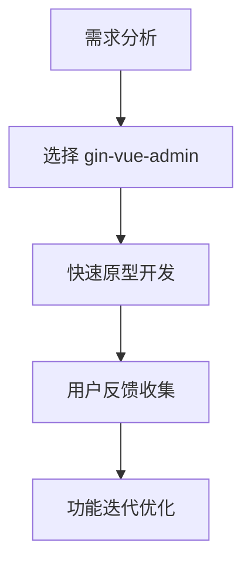
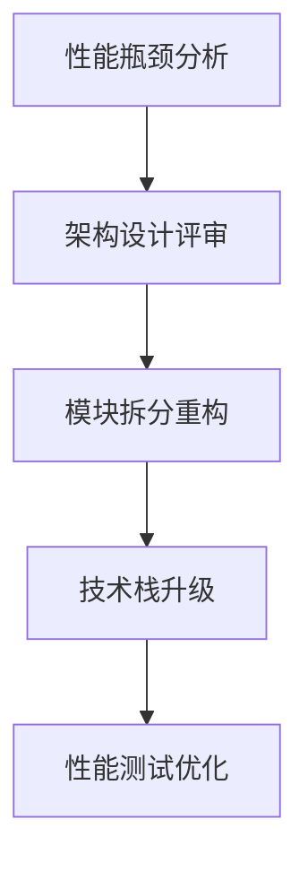
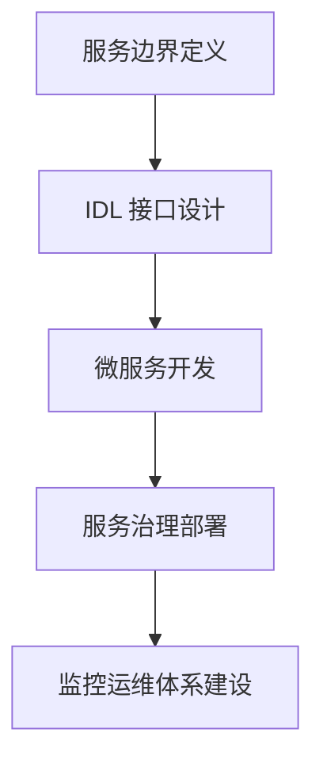

# 工程化

在微服务架构中，工程化实践是确保项目可维护性、可扩展性和团队协作效率的关键。本文将深入探讨从简单模板到复杂微服务架构的不同工程化方案，以及如何根据业务需求选择合适的实践。

## 架构演进之路

### 简单模板：快速起步
对于小型项目或团队初期，推荐使用成熟的模板来快速搭建项目基础架构。

**gin-vue-admin** 是一个优秀的后端管理模板，它提供了：
- 基于 Gin 框架的 RESTful API 设计
- 完整的权限管理系统
- 代码生成工具，支持 CRUD 操作快速开发
- 标准的项目结构和分层设计
- 集成了常用的中间件和工具库

这种模板适合：
- 小型到中型企业管理系统
- 快速原型开发
- 学习和实践 Go Web 开发
- 团队初次接触微服务架构

### 自定义架构：灵活扩展
随着业务复杂度增加，团队需要更具灵活性的架构方案。**nunu + vue3 + el** 的组合提供了这样的可能性：

**nunu** 脚手架工具的优势：
- 基于标准库和主流框架的模块化设计
- 支持 Go 1.18+ 的原生特性
- 内置开发工具链，包含热重载、代码检查等
- 插件化架构，便于扩展和定制
- 完整的 CI/CD 配置模板

**vue3 + el** 前端架构特点：
- 组合式 API，更好的代码组织
- TypeScript 支持，提供类型安全
- Element Plus 组件库，丰富的 UI 组件
- Vite 构建工具，极致的开发体验

这种架构适合：
- 中大型业务系统
- 需要高度定制化的项目
- 团队技术栈成熟，需要更多控制权
- 对性能和维护性有较高要求的项目

### 微服务架构：分布式系统
当业务规模进一步扩大，单体应用难以满足需求时，微服务架构成为必然选择。在这个阶段，**IDL（接口定义语言）** 成为核心设计理念：

**IDL 的核心价值：**
- **声明式接口**：通过 IDL 文件定义服务接口，实现前后端分离开发
- **代码生成**：自动生成客户端和服务端代码，减少重复劳动
- **文档生成**：接口文档与代码同步更新，确保文档的准确性
- **错误处理**：统一的错误码定义和处理机制

**Kratos** 作为 Go 微服务框架的最佳实践，提供了完整的微服务解决方案：
- 基于 protobuf 的服务定义
- 内置的服务发现、负载均衡
- 标准化的错误处理和中间件机制
- 完善的监控和链路追踪支持

## 统一服务端回复信息格式

在微服务架构中，统一的响应格式对于客户端处理、错误管理和系统监控至关重要。不同的服务框架提供了不同的响应处理方式，下面我们深入分析各种方案的优劣。

### Micro HTTP+JSON 模式

**Go-Micro** 采用传统的 HTTP+JSON 通信方式，这种方式具有以下特点：

**服务端实现：**
```go
func (e *Helloworld) Call(ctx context.Context, req *pb.CallRequest, rsp *pb.CallResponse) error {
  logger.Infof("Received Helloworld.Call request: %v", req)
  rsp.Msg = "Hello " + req.Name
  return errors.New("aaa")
}
```

**客户端调用：**
```go
rsp, err := c.Call(context.Background(), &pb.CallRequest{Name: "John"})
```

**优势分析：**
- **简单直观**：符合传统 Web 开发习惯，学习成本低
- **调试友好**：JSON 格式易于人类阅读和调试
- **跨语言兼容**：所有编程语言都支持 HTTP 和 JSON
- **工具丰富**：成熟的 HTTP 调试工具和监控方案

**局限性：**
- **性能开销**：JSON 序列化/反序列化性能相对较低
- **错误处理**：依赖 HTTP 状态码，语义表达有限
- **类型安全**：缺乏编译时类型检查，容易出现运行时错误
- **带宽消耗**：JSON 文本格式相对冗余，网络传输成本较高

### gRPC HTTP2+Protobuf 模式

**gRPC** 采用 HTTP2+Protobuf 的高性能通信方案：

**服务端实现：**
```go
// SayHello implements helloworld.GreeterServer
func (s *server) SayHello(ctx context.Context, in *pb.HelloRequest) (*pb.HelloReply, error) {
  log.Printf("Received: %v", in.GetName())
  return &pb.HelloReply{Message: "Hello " + in.GetName()}, nil
}
```

**客户端调用：**
```go
c := pb.NewGreeterClient(conn)
r, err := c.SayHello(ctx, &pb.HelloRequest{Name: name})
```

**优势分析：**
- **高性能**：二进制协议，序列化性能比 JSON 高 5-10 倍
- **类型安全**：强类型定义，编译时检查，减少运行时错误
- **流式支持**：原生支持双向流式通信，适合实时场景
- **多语言支持**：代码生成工具支持多种编程语言
- **连接复用**：HTTP2 多路复用，减少连接开销

**局限性：**
- **调试复杂**：二进制协议需要专门工具进行调试
- **浏览器兼容**：需要 gRPC-Web 网关才能在浏览器中直接使用
- **学习成本**：Protobuf 语法和工具链学习曲线较陡
- **API 网关依赖**：通常需要 API 网关进行协议转换

### Kratos：Go-Micro 最佳实践

**Kratos** 框架被认为是 Go-Micro 的最佳实践，它在响应格式标准化方面做出了卓越贡献：

#### 1. 错误处理标准化

**通过 Protobuf Enum 定义错误码：**
```protobuf
enum ErrorCode {
  ERROR_CODE_UNSPECIFIED = 0;
  ERROR_CODE_USER_NOT_FOUND = 1001;
  ERROR_CODE_INVALID_PARAMETER = 1002;
  ERROR_CODE_PERMISSION_DENIED = 1003;
  ERROR_CODE_INTERNAL_SERVER = 5000;
}
```

**自动生成错误处理接口：**
```go
// 工具生成的错误处理接口
type ErrorHandler interface {
  HandleError(ctx context.Context, err error) *Error
  IsError(err error, code ErrorCode) bool
  WrapError(ctx context.Context, code ErrorCode, msg string) error
}
```

**优势：**
- 统一的错误码定义，避免重复
- 类型安全的错误处理
- 自动生成错误处理代码
- 跨服务错误传播的一致性

#### 2. Metadata 规范化

**通过 Middleware 规范化服务元信息传递：**
```go
func MetadataMiddleware() middleware.Middleware {
  return func(handler middleware.Handler) middleware.Handler {
    return func(ctx context.Context, req interface{}) (reply interface{}, err error) {
      // 从 context 中提取 metadata
      md, ok := metadata.FromServerContext(ctx)
      if !ok {
        md = metadata.New()
      }

      // 添加标准化的 metadata
      md.Set("x-request-id", uuid.New().String())
      md.Set("x-service-name", "user-service")
      md.Set("x-span-id", tracing.SpanID(ctx))

      // 传递 metadata 给下一个处理器
      ctx = metadata.NewServerContext(ctx, md)

      return handler(ctx, req)
    }
  }
}
```

**支持的标准化 Metadata：**
- 请求追踪：`x-request-id`, `x-trace-id`, `x-span-id`
- 服务信息：`x-service-name`, `x-service-version`
- 用户信息：`x-user-id`, `x-user-roles`
- 调用链：`x-caller-service`, `x-caller-version`
- 安全信息：`x-auth-token`, `x-auth-scheme`

#### 3. Encoding 自动选择

**支持 Accept 和 Content-Type 自动选择内容编码：**
```go
func EncodingMiddleware() middleware.Middleware {
  return func(handler middleware.Handler) middleware.Handler {
    return func(ctx context.Context, req interface{}) (reply interface{}, err error) {
      // 获取请求的 Accept 头
      accept := r.Header.Get("Accept")

      // 根据Accept选择编码器
      var encoder encoding.Encoder
      switch {
      case strings.Contains(accept, "application/json"):
        encoder = encoding.GetCodec("json")
      case strings.Contains(accept, "application/protobuf"):
        encoder = encoding.GetCodec("protobuf")
      case strings.Contains(accept, "application/xml"):
        encoder = encoding.GetCodec("xml")
      default:
        encoder = encoding.GetCodec("json") // 默认 JSON
      }

      // 设置响应的 Content-Type
      w.Header().Set("Content-Type", encoder.ContentType())

      return handler(ctx, req)
    }
  }
}
```

**支持的编码格式：**
- **JSON**：默认格式，调试友好
- **Protobuf**：高性能二进制格式
- **XML**：传统企业应用格式
- **MessagePack**：紧凑的二进制 JSON 替代方案

### 响应格式设计最佳实践

#### 1. 统一响应结构

```go
type Response struct {
  Code    int         `json:"code"`     // 业务状态码
  Message string      `json:"message"`  // 响应消息
  Data    interface{} `json:"data"`     // 响应数据
  Meta    interface{} `json:"meta"`     // 元数据信息
  Trace   interface{} `json:"trace"`    // 追踪信息
}
```

#### 2. 分页响应格式

```go
type PageResponse struct {
  List     interface{} `json:"list"`      // 数据列表
  Page     int         `json:"page"`      // 当前页码
  PageSize int         `json:"page_size"` // 每页数量
  Total    int64       `json:"total"`     // 总记录数
  Pages    int         `json:"pages"`     // 总页数
}
```

#### 3. 错误响应格式

```go
type ErrorResponse struct {
  Code      int      `json:"code"`       // 错误码
  Message   string   `json:"message"`    // 错误消息
  Details   []string `json:"details"`   // 错误详情
  Timestamp string   `json:"timestamp"`  // 错误时间
  TraceID   string   `json:"trace_id"`  // 追踪ID
}
```

### 性能优化建议

1. **缓存策略**：对频繁访问的数据实施缓存
2. **压缩传输**：启用 Gzip 压缩减少网络传输
3. **连接池**：复用 HTTP 连接减少连接开销
4. **批处理**：支持批量操作减少网络请求
5. **异步处理**：对于耗时操作采用异步模式

通过这些统一的响应格式设计，可以显著提升微服务架构的可维护性、可扩展性和用户体验。Kratos 框架在这方面提供了成熟的解决方案，是 Go 微服务开发的最佳实践选择。

## Kratos：Go-Micro 的最佳实践

Kratos 是一个基于 Go 语言的微服务框架，它吸收了 go-micro 的优点，并在此基础上进行了深度优化和标准化。下面我们从多个维度深入分析为什么 Kratos 被认为是 go-micro 的最佳实践。

### 架构设计理念

#### 1. 领域驱动设计 (DDD) 支持

Kratos 采用 DDD 思想进行架构设计，将业务逻辑与技术细节分离：

```go
// 业务领域模型
type User struct {
    ID       int64     `json:"id"`
    Name     string    `json:"name"`
    Email    string    `json:"email"`
    Phone    string    `json:"phone"`
    Status   int       `json:"status"`
    CreateAt time.Time `json:"create_at"`
    UpdateAt time.Time `json:"update_at"`
}

// 业务逻辑接口
type UserRepo interface {
    Create(ctx context.Context, user *User) (*User, error)
    Update(ctx context.Context, user *User) (*User, error)
    Delete(ctx context.Context, id int64) error
    FindByID(ctx context.Context, id int64) (*User, error)
    FindByEmail(ctx context.Context, email string) (*User, error)
}

// 业务服务层
type UserService struct {
    repo UserRepo
    log  *log.Helper
}

func NewUserService(repo UserRepo, logger log.Logger) *UserService {
    return &UserService{
        repo: repo,
        log:  log.NewHelper(logger),
    }
}
```

#### 2. 分层架构模式

Kratos 推荐清晰的分层架构：

```
┌─────────────────────────────────────┐
│           API Layer                 │  // HTTP/gRPC 接口层
├─────────────────────────────────────┤
│         Service Layer               │  // 业务逻辑层
├─────────────────────────────────────┤
│        Business Layer              │  // 业务领域层
├─────────────────────────────────────┤
│        Data Layer                   │  // 数据访问层
└─────────────────────────────────────┘
```

### 核心特性深度解析

#### 1. 配置管理系统

Kratos 提供了强大的配置管理能力：

```go
// 配置结构定义
type Config struct {
    Server struct {
        HTTP struct {
            Network string `json:"network"`
            Addr    string `json:"addr"`
            Timeout struct {
                Server int `json:"server"`
                Client int `json:"client"`
            } `json:"timeout"`
        } `json:"http"`
        GRPC struct {
            Network string `json:"network"`
            Addr    string `json:"addr"`
            Timeout struct {
                Server int `json:"server"`
                Client int `json:"client"`
            } `json:"timeout"`
        } `json:"grpc"`
    } `json:"server"`
    Database struct {
        Driver string `json:"driver"`
        Source string `json:"source"`
    } `json:"database"`
}

// 配置加载
func NewConfig() (*Config, error) {
    var c Config
    conf, err := config.Load("path/to/config.yaml")
    if err != nil {
        return nil, err
    }
    if err := conf.Scan(&c); err != nil {
        return nil, err
    }
    return &c, nil
}
```

**支持的配置源：**
- 文件配置（YAML, JSON, TOML）
- 环境变量
- 配置中心（Nacos, Consul, Etcd）
- 命令行参数

#### 2. 依赖注入 (DI) 系统

Kratos 使用 wire 进行依赖注入：

```go
// wire.go
//+build wireinject

package main

import (
    "github.com/google/wire"
    "github.com/go-kratos/kratos/v2"
    "github.com/go-kratos/kratos/v2/log"
)

var ProviderSet = wire.NewSet(NewUserService, NewUserRepo, NewDB)

func InitApp(*Config) (*kratos.App, func(), error) {
    wire.Build(ProviderSet, NewApp, NewLogger)
    return new(kratos.App), nil, nil
}
```

**依赖注入的优势：**
- 解耦组件依赖关系
- 便于单元测试
- 提高代码可维护性
- 支持配置化管理

#### 3. 中间件 (Middleware) 生态

Kratos 提供了丰富的中间件：

```go
// 自定义中间件
func LoggingMiddleware(logger log.Logger) middleware.Middleware {
    return func(handler middleware.Handler) middleware.Handler {
        return func(ctx context.Context, req interface{}) (reply interface{}, err error) {
            start := time.Now()

            // 记录请求开始
            logContext := log.NewContext(ctx)
            logContext = log.WithContext(logContext, logger)

            defer func() {
                // 记录请求结束
                logger.WithContext(logContext).Infof(
                    "method: %s, args: %v, reply: %v, cost: %dms, error: %v",
                    req, reply, time.Since(start).Milliseconds(), err,
                )
            }()

            return handler(ctx, req)
        }
    }
}

// 链式中间件
func NewHTTPServer(c *Config, logger log.Logger, service *UserService) *http.Server {
    var opts = []http.ServerOption{
        http.Middleware(
            recovery.Recovery(),
            logging.Server(logger),
            tracing.Server(),
            metrics.Server(),
            validate.Validator(),
        ),
    }
    // ...
}
```

**内置中间件：**
- **Recovery**：异常恢复，防止服务崩溃
- **Logging**：请求日志记录
- **Tracing**：链路追踪（支持 Jaeger, Zipkin）
- **Metrics**：监控指标收集
- **Validation**：参数验证
- **Circuit Breaker**：熔断器
- **Rate Limiter**：限流
- **Auth**：认证授权

#### 4. 数据访问层抽象

Kratos 提供了数据访问层的标准抽象：

```go
// 数据访问接口
type Data interface {
    UserRepo() UserRepo
    OrderRepo() OrderRepo
    Close() error
}

// 数据访问实现
type data struct {
    db    *sql.DB
    redis *redis.Client

    userRepo  UserRepo
    orderRepo OrderRepo
}

func NewData(c *Config, logger log.Logger) (*data, func(), error) {
    // 初始化数据库连接
    db, err := sql.Open(c.Database.Driver, c.Database.Source)
    if err != nil {
        return nil, nil, err
    }

    // 初始化 Redis 连接
    rdb := redis.NewClient(&redis.Options{
        Addr:     c.Redis.Addr,
        Password: c.Redis.Password,
        DB:       c.Redis.DB,
    })

    // 创建数据仓库
    userRepo := NewUserRepo(db, logger)
    orderRepo := NewOrderRepo(db, logger)

    d := &data{
        db:        db,
        redis:     rdb,
        userRepo:  userRepo,
        orderRepo: orderRepo,
    }

    return d, func() {
        d.Close()
    }, nil
}

func (d *data) Close() error {
    if d.db != nil {
        d.db.Close()
    }
    if d.redis != nil {
        d.redis.Close()
    }
    return nil
}
```

### 服务发现与治理

#### 1. 多种注册中心支持

```go
// Consul 注册中心配置
func NewConsulRegistry(c *Config) (discovery.Registry, error) {
    return consul.New(
        consul.WithAddress(c.Consul.Address),
        consul.WithTimeout(time.Second*10),
        consul.WithHeartbeat(true),
        consul.WithHealthCheck(true),
    )
}

// Etcd 注册中心配置
func NewEtcdRegistry(c *Config) (discovery.Registry, error) {
    return etcd.New(
        etcd.WithEndpoints(c.Etcd.Endpoints...),
        etcd.WithDialTimeout(time.Second*3),
        etcd.WithTLSConfig(c.Etcd.TLS),
    )
}
```

#### 2. 负载均衡策略

```go
// 负载均衡配置
func NewGRPCClient(c *Config, r discovery.Registry) *grpc.ClientConn {
    conn, err := grpc.DialInsecure(
        context.Background(),
        grpc.WithEndpoint("discovery:///user-service"),
        grpc.WithDiscovery(r),
        grpc.WithLoadBalancer(
            // 轮询负载均衡
            loadbalance.RoundRobin(),
            // 加权负载均衡
            // loadbalance.WeightedRoundRobin(),
            // 一致性哈希
            // loadbalance.ConsistentHash(),
        ),
    )
    if err != nil {
        panic(err)
    }
    return conn
}
```

#### 3. 熔断与限流

```go
// 熔断器配置
func NewCircuitBreaker() *breaker.Breaker {
    return breaker.New(breaker.WithWindow(10*time.Second),
        breaker.WithBucket(10),
        breaker.WithSlideWindow(breaker.SlideWindowCount),
        breaker.WithThreshold(5),
        breaker.WithSuccessRate(0.6),
    )
}

// 限流器配置
func NewRateLimiter() *rate.Limiter {
    return rate.NewLimiter(rate.Every(time.Second), 100) // 100 qps
}
```

### 监控与可观测性

#### 1. Prometheus 指标

```go
// 自定义指标
var (
    requestDuration = prometheus.NewHistogramVec(prometheus.HistogramOpts{
        Name:    "http_request_duration_seconds",
        Help:    "HTTP request duration in seconds",
        Buckets: prometheus.DefBuckets,
    }, []string{"method", "path", "status"})

    requestTotal = prometheus.NewCounterVec(prometheus.CounterOpts{
        Name: "http_requests_total",
        Help: "Total number of HTTP requests",
    }, []string{"method", "path", "status"})
)

func MetricsMiddleware() middleware.Middleware {
    return func(handler middleware.Handler) middleware.Handler {
        return func(ctx context.Context, req interface{}) (reply interface{}, err error) {
            start := time.Now()

            defer func() {
                duration := time.Since(start).Seconds()
                method := req.(http.Request).Method
                path := req.(http.Request).URL.Path
                status := "200"
                if err != nil {
                    status = "500"
                }

                requestDuration.WithLabelValues(method, path, status).Observe(duration)
                requestTotal.WithLabelValues(method, path, status).Inc()
            }()

            return handler(ctx, req)
        }
    }
}
```

#### 2. 链路追踪集成

```go
// Jaeger 链路追踪配置
func NewTracer(c *Config) (opentracing.Tracer, io.Closer, error) {
    cfg := jaegercfg.Configuration{
        ServiceName: "user-service",
        Sampler: &jaegercfg.SamplerConfig{
            Type:  jaeger.SamplerTypeConst,
            Param: 1,
        },
        Reporter: &jaegercfg.ReporterConfig{
            LogSpans:           true,
            LocalAgentHostPort: c.Jaeger.Address,
        },
    }

    return cfg.NewTracer()
}

// 链路追踪中间件
func TracingMiddleware(tracer opentracing.Tracer) middleware.Middleware {
    return func(handler middleware.Handler) middleware.Handler {
        return func(ctx context.Context, req interface{}) (reply interface{}, err error) {
            // 开始追踪
            span := tracer.StartSpan("operation")
            defer span.Finish()

            // 设置上下文
            ctx = opentracing.ContextWithSpan(ctx, span)

            return handler(ctx, req)
        }
    }
}
```

### 测试支持

#### 1. 单元测试

```go
func TestUserService_Create(t *testing.T) {
    // 创建模拟存储
    mockRepo := &MockUserRepo{
        CreateFunc: func(ctx context.Context, user *User) (*User, error) {
            user.ID = 1
            return user, nil
        },
    }

    // 创建服务
    service := NewUserService(mockRepo, log.DefaultLogger)

    // 执行测试
    user := &User{
        Name:  "test",
        Email: "test@example.com",
    }

    result, err := service.Create(context.Background(), user)
    assert.NoError(t, err)
    assert.Equal(t, int64(1), result.ID)
    assert.Equal(t, "test", result.Name)
}
```

#### 2. 集成测试

```go
func TestUserGRPCServer_Create(t *testing.T) {
    // 创建测试服务器
    server := NewUserGRPCServer(NewUserService(NewMockRepo(), log.DefaultLogger))

    // 启动 gRPC 服务器
    lis, err := net.Listen("tcp", ":0")
    if err != nil {
        t.Fatal(err)
    }

    s := grpc.NewServer()
    pb.RegisterUserServiceServer(s, server)
    go s.Serve(lis)
    defer s.Stop()

    // 创建客户端
    conn, err := grpc.Dial(lis.Addr().String(), grpc.WithInsecure())
    if err != nil {
        t.Fatal(err)
    }
    defer conn.Close()

    client := pb.NewUserServiceClient(conn)

    // 执行测试
    req := &pb.CreateUserRequest{
        Name:  "test",
        Email: "test@example.com",
    }

    resp, err := client.Create(context.Background(), req)
    assert.NoError(t, err)
    assert.NotZero(t, resp.Id)
}
```

### 部署与运维

#### 1. 容器化支持

```dockerfile
# Dockerfile
FROM golang:1.18-alpine AS builder

WORKDIR /app
COPY go.mod go.sum ./
RUN go mod download

COPY . .
RUN CGO_ENABLED=0 GOOS=linux go build -a -installsuffix cgo -o user-service ./cmd/user

FROM alpine:latest
RUN apk --no-cache add ca-certificates tzdata
WORKDIR /root/
COPY --from=builder /app/user-service .

CMD ["./user-service"]
```

#### 2. Kubernetes 部署

```yaml
# deployment.yaml
apiVersion: apps/v1
kind: Deployment
metadata:
  name: user-service
spec:
  replicas: 3
  selector:
    matchLabels:
      app: user-service
  template:
    metadata:
      labels:
        app: user-service
    spec:
      containers:
      - name: user-service
        image: user-service:latest
        ports:
        - containerPort: 8000
        - containerPort: 9000
        env:
        - name: DATABASE_SOURCE
          valueFrom:
            secretKeyRef:
              name: database-secret
              key: source
        livenessProbe:
          httpGet:
            path: /health
            port: 8000
          initialDelaySeconds: 30
          periodSeconds: 10
        readinessProbe:
          httpGet:
            path: /ready
            port: 8000
          initialDelaySeconds: 5
          periodSeconds: 5
```

### 总结

Kratos 作为 go-micro 的最佳实践，具有以下核心优势：

1. **标准化架构**：提供完整的微服务架构标准，包括分层设计、接口定义、错误处理等
2. **丰富的生态**：内置完整的中间件、监控、日志、链路追踪等基础设施
3. **工程化实践**：提供配置管理、依赖注入、测试支持等工程化工具
4. **云原生支持**：完美适配容器化、K8s 部署的云原生架构
5. **社区活跃**：拥有活跃的开发者社区，持续更新和维护

对于正在构建或重构微服务架构的团队来说，Kratos 提供了一个经过实践检验的、完整的解决方案，能够显著降低开发复杂度，提高开发效率和系统稳定性。

## 实践指南：如何选择合适的技术栈

### 1. 项目规模评估

#### 小型项目（5人以下，3个月内交付）
**推荐方案：gin-vue-admin**
- **适用场景**：内部工具、小型管理系统、原型开发
- **技术优势**：开箱即用、文档完善、社区支持好
- **风险控制**：技术栈成熟，学习成本低，容易招聘开发人员

**实施步骤：**
```bash
# 1. 克隆项目模板
git clone https://github.com/flipped-aurora/gin-vue-admin.git

# 2. 初始化项目
cd gin-vue-admin
go mod tidy
npm install

# 3. 启动开发服务
go run main.go
npm run dev
```

#### 中型项目（10-20人，6-12个月）
**推荐方案：nunu + vue3 + el**
- **适用场景**：企业级应用、B端产品、需要高度定制化的项目
- **技术优势**：架构灵活、现代化技术栈、工程化程度高
- **风险控制**：团队需要有一定的架构经验，技术选型相对复杂

**项目初始化：**
```bash
# 1. 创建项目结构
mkdir my-project
cd my-project

# 2. 初始化后端
nunu new backend
cd backend
go mod init my-project/backend

# 3. 初始化前端
npm create vue@latest frontend
cd frontend
npm install element-plus @element-plus/icons-vue
```

#### 大型项目（20人以上，12个月以上）
**推荐方案：Kratos 微服务架构**
- **适用场景**：分布式系统、高并发应用、需要长期维护的核心业务
- **技术优势**：微服务治理、可观测性、云原生支持
- **风险控制**：需要专业的 DevOps 团队，架构复杂度高

**服务初始化：**
```bash
# 1. 安装 Kratos CLI
go install github.com/go-kratos/kratos/cmd/kratos/v2@latest

# 2. 创建用户服务
kratos new user-service
cd user-service

# 3. 生成 proto 代码
make proto

# 4. 启动服务
kratos run
```

### 2. 技术决策矩阵

| 维度 | gin-vue-admin | nunu + vue3 + el | Kratos |
|------|---------------|------------------|---------|
| **开发速度** | ⭐⭐⭐⭐⭐ | ⭐⭐⭐ | ⭐⭐ |
| **扩展性** | ⭐⭐ | ⭐⭐⭐⭐ | ⭐⭐⭐⭐⭐ |
| **维护成本** | ⭐⭐⭐⭐⭐ | ⭐⭐⭐ | ⭐⭐ |
| **性能** | ⭐⭐⭐ | ⭐⭐⭐⭐ | ⭐⭐⭐⭐⭐ |
| **学习曲线** | ⭐⭐⭐⭐⭐ | ⭐⭐⭐ | ⭐⭐ |
| **社区支持** | ⭐⭐⭐⭐ | ⭐⭐⭐ | ⭐⭐⭐⭐⭐ |

### 3. 架构演进路径

#### 阶段一：单体快速验证


**关键实践：**
- 使用模板快速搭建基础架构
- 专注于业务功能实现
- 保持代码结构清晰，为后续重构做准备
- 建立基础的 CI/CD 流程

#### 阶段二：架构优化重构


**重构重点：**
- 将业务模块按领域进行拆分
- 引入 nunu 框架提升工程化水平
- 前端升级到 Vue3 + Element Plus
- 建立完善的测试体系

#### 阶段三：微服务化转型


**转型策略：**
- 识别核心业务域，逐步拆分微服务
- 采用 Kratos 框架构建新服务
- 建立服务网格和 API 网关
- 实现自动化运维和监控

### 4. 实际案例分享

#### 案例1：电商后台管理系统
**背景**：创业公司，5人团队，需要在2个月内上线
**选择**：gin-vue-admin
**结果**：按时交付，功能稳定，用户满意度高

**技术栈：**
- 后端：Gin + GORM + Redis
- 前端：Vue2 + Element UI
- 部署：Docker + Nginx

**经验总结：**
```go
// 使用 gin-vue-admin 的快速开发特性
func (s *OrderService) CreateOrder(ctx context.Context, req *pb.CreateOrderRequest) (*pb.CreateOrderReply, error) {
    // 自动生成的 CRUD 操作
    order := &model.Order{
        UserID:    req.UserId,
        ProductID: req.ProductId,
        Quantity:  req.Quantity,
        Amount:    req.Amount,
        Status:    "pending",
    }

    if err := s.db.Create(order).Error; err != nil {
        return nil, errors.New("创建订单失败")
    }

    return &pb.CreateOrderReply{
        OrderId: order.ID,
        Status:  order.Status,
    }, nil
}
```

#### 案例2：企业级 SaaS 平台
**背景**：中型企业，15人团队，预计开发周期8个月
**选择**：nunu + vue3 + el
**结果**：架构灵活，性能优异，易于扩展

**技术栈：**
- 后端：nunu + Go 1.18 + PostgreSQL
- 前端：Vue3 + TypeScript + Element Plus
- 部署：Kubernetes + Helm

**架构亮点：**
```go
// 使用 nunu 的模块化架构
type UserService struct {
    repo   repository.UserRepository
    cache  cache.Cache
    logger log.Logger
}

func NewUserService(repo repository.UserRepository, cache cache.Cache, logger log.Logger) *UserService {
    return &UserService{
        repo:   repo,
        cache:  cache,
        logger: logger,
    }
}

func (s *UserService) GetUserProfile(ctx context.Context, userID int64) (*dto.UserProfile, error) {
    // 先从缓存读取
    if profile, err := s.cache.Get(ctx, fmt.Sprintf("user_profile:%d", userID)); err == nil {
        return profile.(*dto.UserProfile), nil
    }

    // 缓存未命中，从数据库读取
    user, err := s.repo.FindByID(ctx, userID)
    if err != nil {
        return nil, err
    }

    profile := &dto.UserProfile{
        ID:       user.ID,
        Name:     user.Name,
        Email:    user.Email,
        Avatar:   user.Avatar,
        CreateAt: user.CreateAt,
    }

    // 写入缓存
    s.cache.Set(ctx, fmt.Sprintf("user_profile:%d", userID), profile, time.Hour)

    return profile, nil
}
```

#### 案例3：金融科技平台
**背景**：大型企业，50人团队，长期维护的核心业务
**选择**：Kratos 微服务架构
**结果**：系统稳定，性能卓越，支持高并发

**技术栈：**
- 后端：Kratos + gRPC + MySQL + Redis
- 前端：微前端架构 + Vue3
- 基础设施：Kubernetes + Istio + Prometheus

**核心实现：**
```go
// 使用 Kratos 的微服务架构
// proto/user_service.proto
service UserService {
  rpc CreateUser (CreateUserRequest) returns (CreateUserReply);
  rpc GetUserProfile (GetUserProfileRequest) returns (GetUserProfileReply);
  rpc UpdateUser (UpdateUserRequest) returns (UpdateUserReply);
}

// service/user_service.go
type UserService struct {
    pb.UnimplementedUserServiceServer
    repo   repository.UserRepository
    log    *log.Helper
}

func NewUserService(repo repository.UserRepository, logger log.Logger) *UserService {
    return &UserService{
        repo: repo,
        log:  log.NewHelper(logger),
    }
}

func (s *UserService) CreateUser(ctx context.Context, req *pb.CreateUserRequest) (*pb.CreateUserReply, error) {
    // 参数验证
    if req.Name == "" {
        return nil, errors.BadRequest("INVALID_NAME", "用户名不能为空")
    }
    if !emailRegex.MatchString(req.Email) {
        return nil, errors.BadRequest("INVALID_EMAIL", "邮箱格式不正确")
    }

    // 业务逻辑
    user := &entity.User{
        Name:  req.Name,
        Email: req.Email,
        Phone: req.Phone,
    }

    createdUser, err := s.repo.Create(ctx, user)
    if err != nil {
        s.log.WithContext(ctx).Errorf("创建用户失败: %v", err)
        return nil, errors.InternalServer("CREATE_USER_FAILED", "创建用户失败")
    }

    return &pb.CreateUserReply{
        UserId:    createdUser.ID,
        CreatedAt: createdUser.CreateAt.Unix(),
    }, nil
}
```

### 5. 最佳实践总结

#### 开发流程优化
1. **代码审查**：建立严格的 Code Review 机制
2. **自动化测试**：单元测试覆盖率不低于80%
3. **持续集成**：每次提交自动构建和测试
4. **文档驱动**：先写文档再写代码

#### 性能优化策略
1. **数据库优化**：合理使用索引，避免 N+1 查询
2. **缓存策略**：多级缓存架构，热点数据优先缓存
3. **并发处理**：使用 goroutine 和 channel 处理并发
4. **资源管理**：连接池、对象池等资源复用

#### 监控运维体系
1. **指标监控**：Prometheus + Grafana 全方位监控
2. **日志管理**：结构化日志，集中收集分析
3. **链路追踪**：Jaeger 分布式链路追踪
4. **告警机制**：基于阈值的智能告警

### 6. 未来展望

随着云原生技术的不断发展，Go 微服务架构也在持续演进：

#### 技术趋势
- **Service Mesh**：服务网格化，基础设施下沉
- **Serverless**：函数计算，按需付费
- **AI 集成**：智能运维，自动化运维
- **边缘计算**：就近服务，降低延迟

#### 架构演进
- **混合架构**：单体 + 微服务混合部署
- **多云部署**：跨云平台部署，提高可用性
- **事件驱动**：基于事件的消息驱动架构
- **联邦学习**：分布式机器学习架构

通过合理的技术选型和架构设计，可以在不同的业务阶段选择最适合的技术栈，实现业务的快速迭代和长期稳定运行。Kratos 作为 Go 微服务的最佳实践，为构建现代化分布式系统提供了强有力的支撑。


